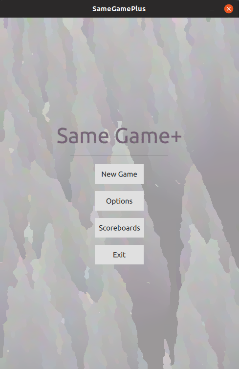
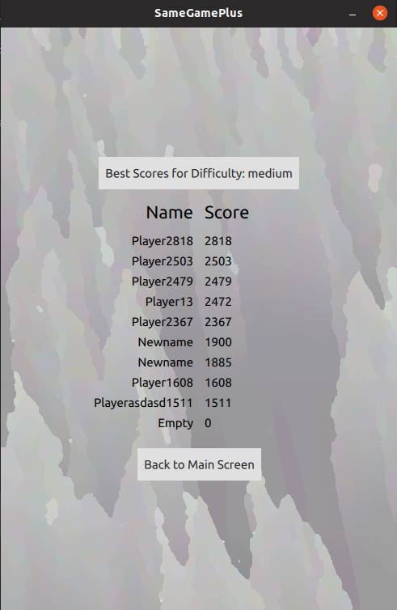
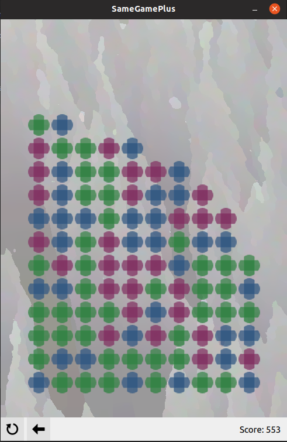
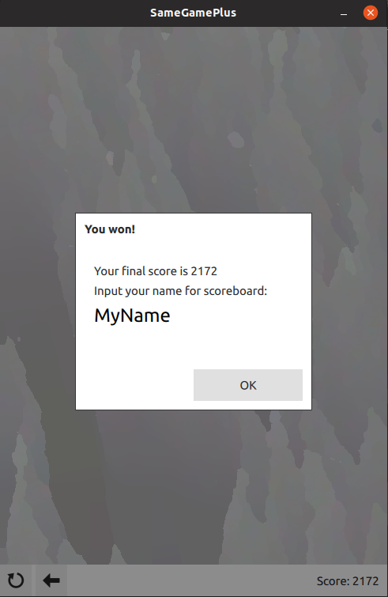

# Same Game Plus

Yet another sample of destroy-blocks-of-matching-colors

Made as learning project to test capabilities of Qt5 and QML

Features:
 - Animated blocks destruction
 - Medium and hard difficulty modes
 - Random levels and loading pre-created levels
 - Scoreboard (stored in .txt file)
 - Keeping settings in system settings storage

 
 
 
 